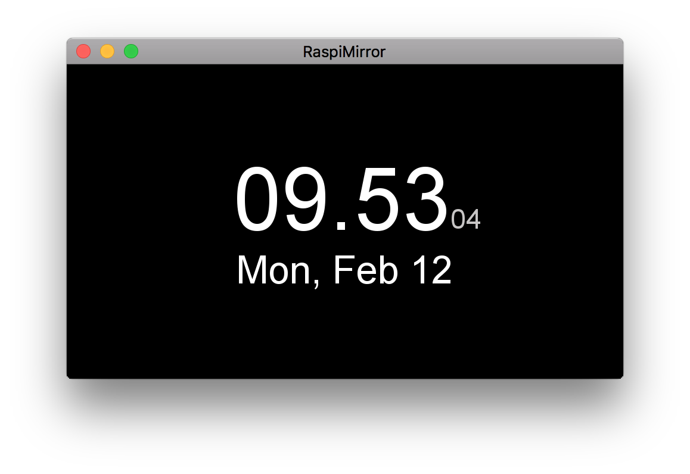
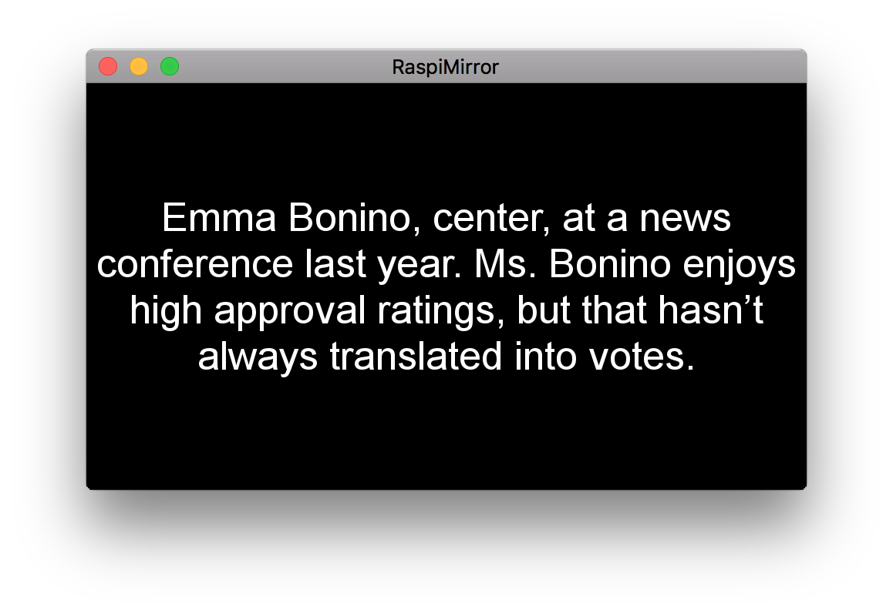
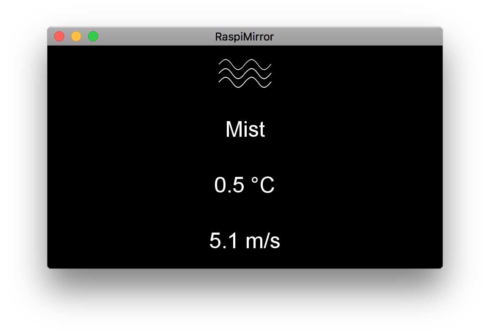

# RaspiMirror

This is a small hardware/software project to get a somewhat smart desk gadget. It will be a screen with a number of pages that can be navigated by swiping your hand through the air. The hand movements will be captured using two IR sensors.

Clock                      |  RSS feed                 |  Weather
:-------------------------:|:-------------------------:|:-------------------------:
|  |  

## Getting Started

Here is the list of hardware used:

* Raspberry Pi Zero W
* 3.5" Screen
* 2 IR sensors

The GUI is run by [kivy](https://kivy.org/#home) and is downloadable for your system [here](https://kivy.org/#download).
These instructions will get you a copy of the project up and running on your local machine for development and testing purposes. See deployment for notes on how to deploy the project on a live system.

### Prerequisites

Assuming you have installed kivy it is now time to get the dependencies. The feedparser package is used for parsing the RSS data. This can be installed by running:

```
$ kivy -m pip install feedparser
```

You will also need a free API key from [openweathermaps](https://openweathermap.org/api).

### Installing

Download the content by running

```
$ git clone git://github.com/srydell/raspiMirror.git
```

Change directory and read exampleSecret.txt. You will need to add you API key from openweathermaps and your location in a new file called "secret.txt".

How to run a kivy program is different for Mac/(linux/windows) users.

For Mac users:

```
$ kivy main.py
```

For linux/windows users:

```
$ python main.py
```

Good luck!
